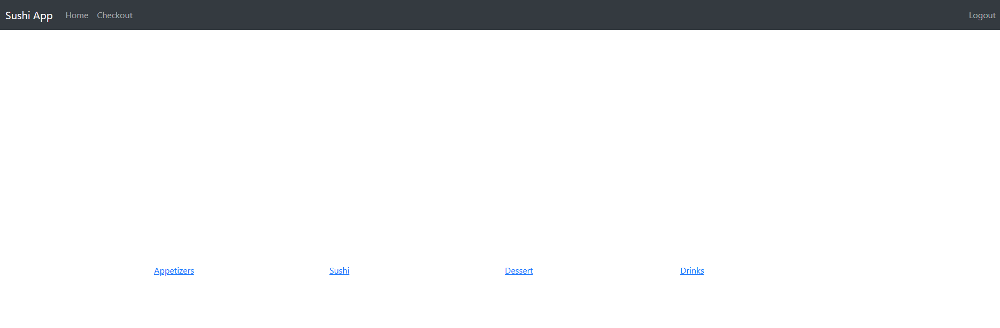
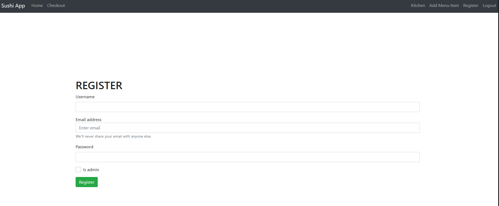
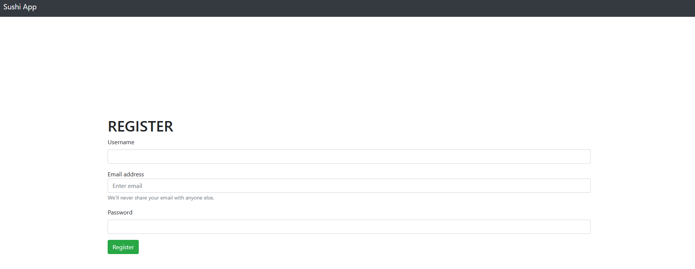
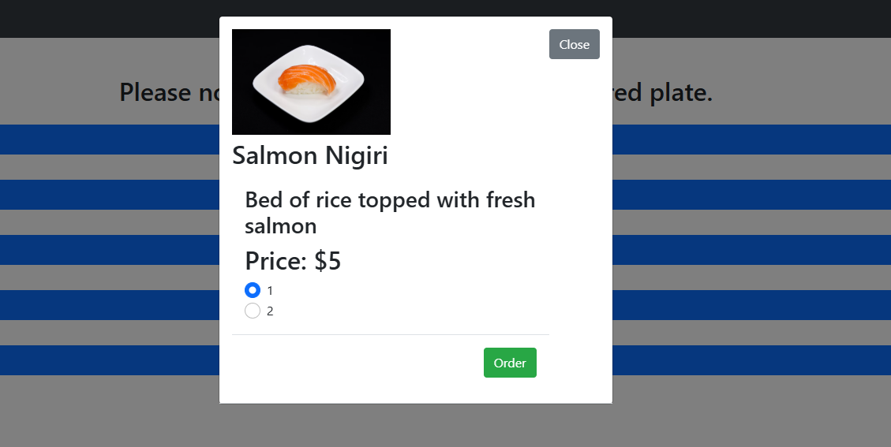
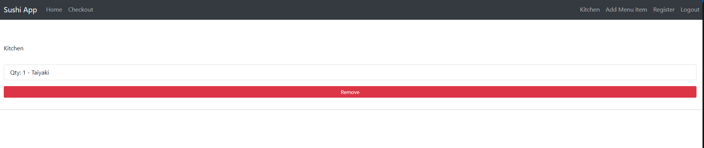
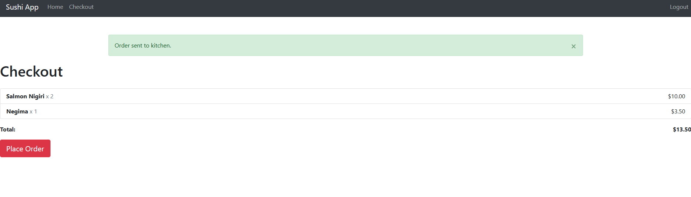

# ConveyorBeltSushiECommereceApp
This is an EJS/MongoDB application with full CRUD functionality, to mimic the tablets found at Conveyor Belt Sushi Restaurants, makes use of Bootstrap, EJS, Express, Javascript, and Node.JS.
List of functionality:
* Create administrator roles and new users, as well as login as guest if user doesn't want to create an account.
* Create new orders and checkout total orders.
* For administrators can create other admins and update the kitchen to delete already completed orders or add or delete menu items.

